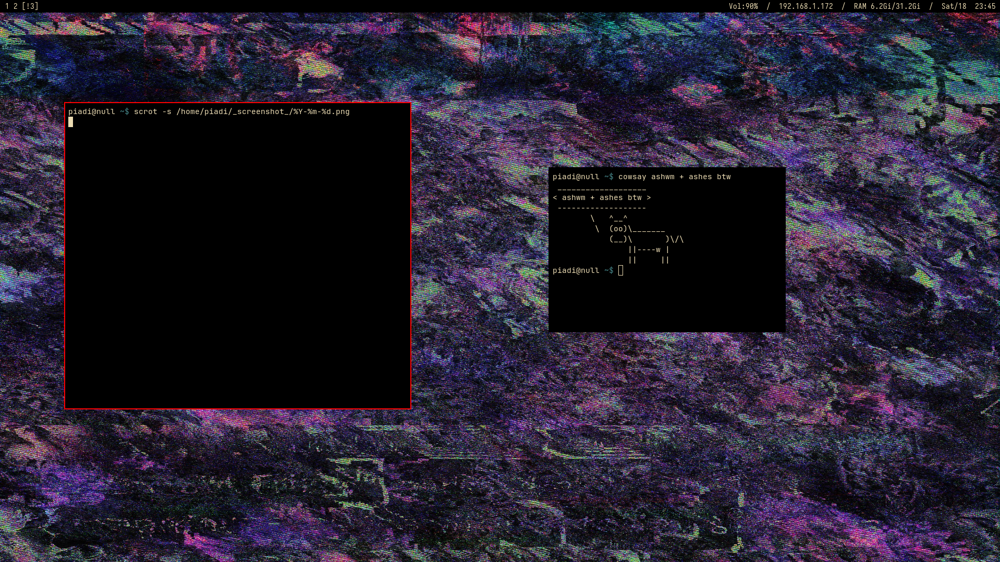

# ashes

**ashes** is a suckless X11 status bar made to work with **ash-wm**, a suckless X11 tiling window manager.
* [ash-wm repository](https://github.com/piadi-su/ash-wm.git)

It is a fork of **ash**, another simple X11 bar originally designed to work with i3wm.
* [ash repository](https://github.com/piadi-su/ash.git)

## dependencies

```txt
libx11 libxinerama libxft fontconfig
```

## installation

```bash
git clone https://github.com/piadi-su/ashes.git
cd ashes
chmod +x installer.sh
./installer.sh
```

## config

ashes is configured via the config.h, so you need to recomplie 
every time u make a change

# sceenshot


---

# license

Released under the GPLv3 (or later) License.
